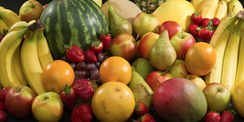
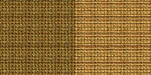
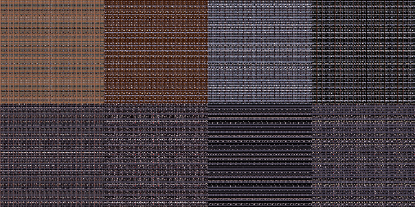

# Overview

In this challenge, you will have to figure out how to turn an image like this:

Into an image like this:

And then back again. While doing this project, you will learn a cool, simple way to send secret images to your friends.

# Skills you'll need

The cipher itself uses modular arithmetic to mangle the pixels of an image. As such, you should know some basic arithmetic (i.e. long division, remainders, etc.).

Since your program must be able to read and write the pixels of an image file, you should learn how to manipulate images with code. Most programming languages come with standard tools for doing this.

# Specifics

The cipher manipulates 151x151 blocks of pixels at a time (the number 151 was chosen semi-arbitrarily, but it had to be prime). This means that any image you wish to cipher or decipher must be of dimensions MxN where both M and N are divisible by 151.

We will now introduce some notation. For a 151x151 image called `img`, we use the notation `img[x,y]` to refer to the pixel at coordinates `(x, y)` in `img`, where coordinates start from the top-left corner and go rightwards and downwards. For example, `img[0,0]` is the top-left pixel in the image, and `img[150,150]` is the bottom-right pixel in the same image.

When we want to encode an image, `img`, we really want to compute a new image `res` which is the ciphered version of `img`. To do this, we define a formula for computing the pixel at `(x, y)` in `res`:

    res[x,y] = img[(64*x)%151, (64*y)%151]

Notice that we are using `*` to denote multiplication, and `%` to denote modulus. (The number 64 was chosen semi-arbitrarily, but I wanted it to be close to 151/2). Since 151 is prime, it turns out that `(64*x)%151` will yield a different value for every value of x between 0 and 150. This formula essentially defines a way to permute all of the numbers between 0 and 150. You needn't understand why this is the case, since proving this requires some number theory.

Given the formula for the encoded image above, it should be pretty easy to figure out an equivalent formula for decoding:

    decoded[(64*x),(64*y)] = encoded[x,y]

Larger images are encoded by encoding the individual 151x151 blocks of the image. If you look at one of the cipher images in this repository, it should be clear what this means.

Your challenge is to decipher the following image, found in [images/decipher_me.png](images/decipher_me.png). It looks like this:

If you want a bonus challenge, make a program which can cipher images as well as decipher them.

# Pitfalls

If you resize the original image, even by a little bit, the results will be horrible. It is also suggested that you do not apply JPEG compression to a cipher image, because this compression will distort the pixels of the final images.
