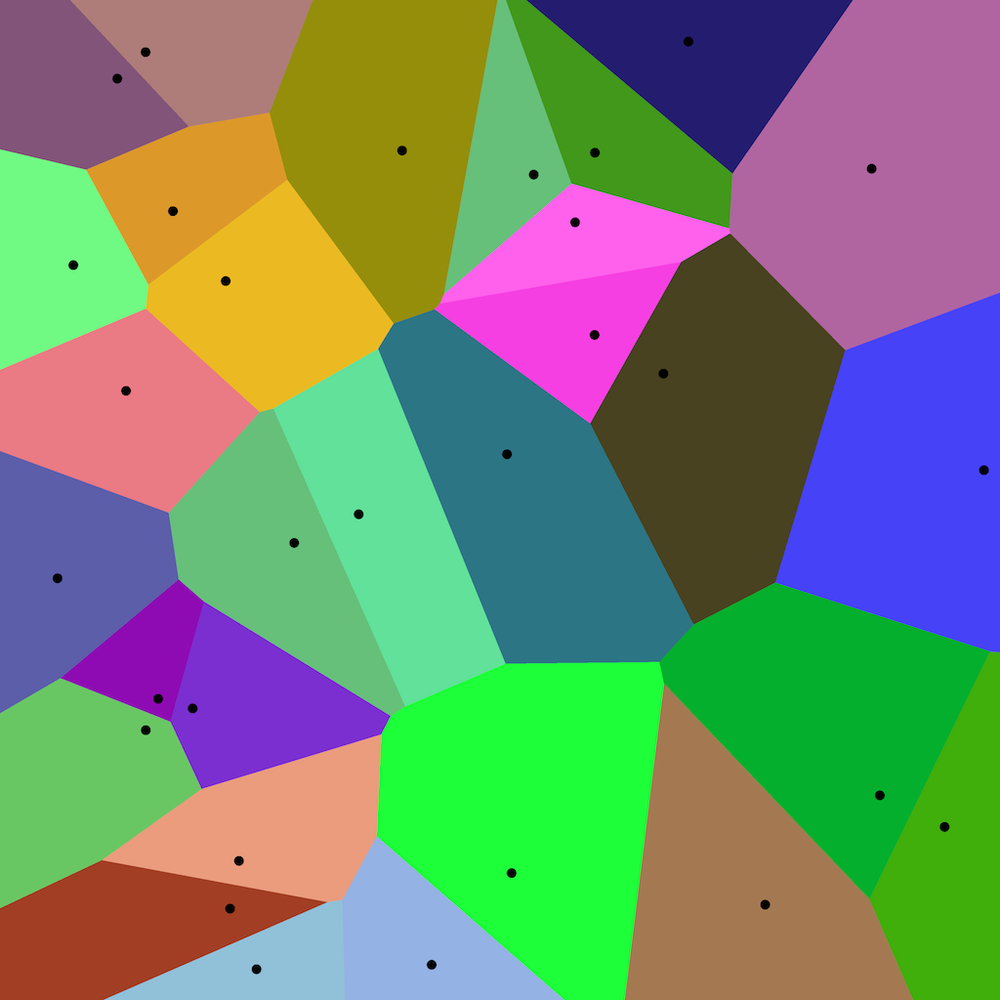

# Overview

Suppose you have 30 random points on a 2-dimensional grid. If I point to a place on this grid, it should be fairly easy to tell which point is closest to the spot I'm pointing. This is called "Nearest Neighbors" and is one of the simplest machine learning algorithms. In Nearest Neighbors, you identify new data points by equating them to their nearest neighboring data point.

This challenge is to generate 30 random points on a 2-dimensional grid and draw a diagram like so:

In this visualization, every pixel is colored according to which data point it is closest to. For example, every data point which is closest to the top right data point is colored dark pink. Your program should generate the data points and colors randomly. You can generate an image of your result, or draw your result to the screen using some kind of graphics API.

# Make it harder for yourself

Here are some additional things you could try to make this project more difficult:

 * Make the colors change gradually between data points, yielding some kind of artistic drawing.
 * Support anti-aliasing to make the lines between the boundaries smoother.
 * Let the user create new points by clicking their mouse.
